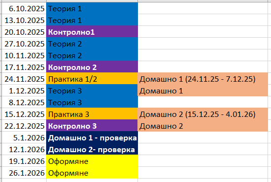

# Въведение в курса по Операционни Системи

## Преподавател
**Ивайло Божилов**  
[ibozhilov@elsys-bg.org](mailto:ibozhilov@elsys-bg.org)

---

## Структура на курса
- Разделен на две:  
  - **Теория** (72 часа - 2 срока × 18 седмици × 2 часа)  
  - **Практика** (72 часа - 2 срока × 18 седмици × 2 часа)  

---

## Часове по Операционни системи - Практика
- Ще работим главно на **Linux**  
  - Инсталирайте си Linux дистрибуция по ваш избор на лаптопа или на виртуална машина.  
  - Или си настройте **Windows Subsystem for Linux (WSL)**.  
- На упражненията ще пишете код, така че носете си лаптопи.  

---

## Google Classroom
- [Google Classroom](https://classroom.google.com/u/6/c/ODA2NzkxNTI4MzQx)  

Използва се за:  
- Публикуване на важни съобщения 
- Въпроси от ваша страна
- Качване на домашни  
- Качване на презентациите от часовете  
- Онлайн часове (ако се наложи)  

---

## Ресурси
- [GitHub Repo](https://github.com/os-tues/os-tues-2025-2026-11a)  
- Презентации от Google Classroom  

---

## Теория – I срок
1. История и структура на компютърните системи  
2. Структура на операционните системи  
3. Нишки и синхронизация  
4. Комуникация между процеси посредством тръби (pipes) (?)

---

## Практика – I срок
1. Въведение в Linux. Указатели, динамична памет и разпределение на паметта  
2. Работа с файлове (open, close, read, write, lseek)  
3. Работа с процеси (pipe, exec, wait, kill)  
4. Работа с нишки и синхронизация чрез Mutex (pthread)  

---

## Оценки теория – I срок
- 3 писмени контролни (3 оценки)  

**Формат на контролните:**  
- 2 „трудни“ въпроса с отворен отговор (по 4 т.)  
- 2 „лесни“ въпроса с отворен отговор (по 3 т.)  
- 2 въпроса с ограждане (по 2 т.)  
- Време: 30–40 мин  

**Скала за оценяване:**  
- 0–5 т. = Слаб (2)  
- 6–9 т. = Среден (3)  
- 10–12 т. = Добър (4)  
- 13–15 т. = Мн. Добър (5)  
- 16–18 т. = Отличен (6)  

Допълнителни оценки: малки контролни („петминутка“), устни изпитвания, оформяне и др.  

---

## Оценки практика – I срок
- Всяка задача = програма, която трябва да напишете и качите в Google Classroom.  

Оценката се формира на база:  
- Изпълнява ли програмата условието  
- Устно изпитване за разбиране на кода  

**Домашни:**  
- **Домашно 1**  
  - 2 задачи × 200 точки  
  - Обща оценка = 2 + (точки / 100)  

- **Домашно 2**  
  - 2 задачи × 200 точки  
  - Отделна оценка за всяка задача  
  - Оценка = 2 + (точки / 50)  

Допълнителни оценки: малки контролни („петминутка“), устни изпитвания, оформяне и др.  

---

## Програма (подлежи на промени)

