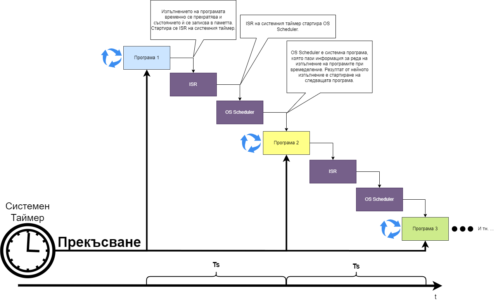
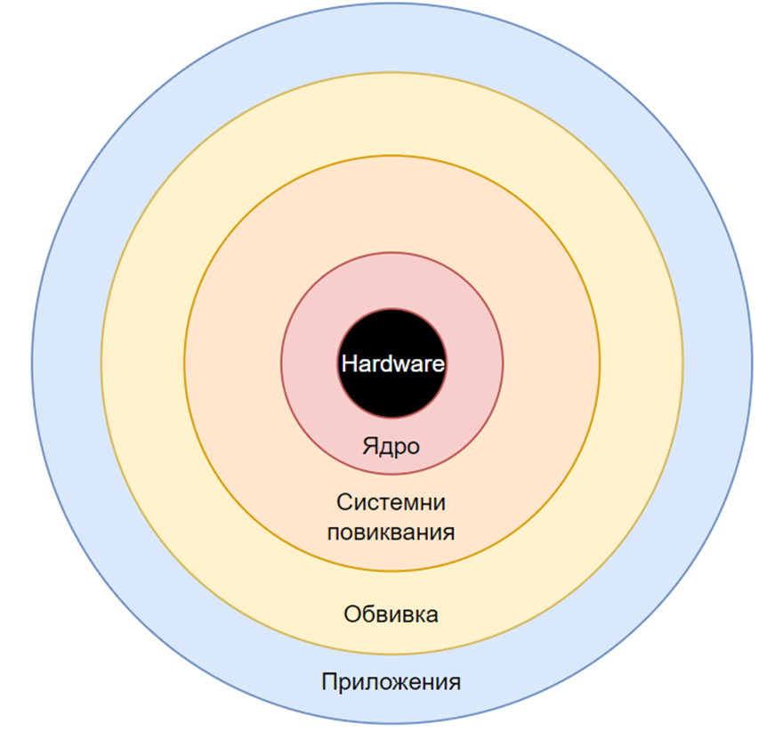
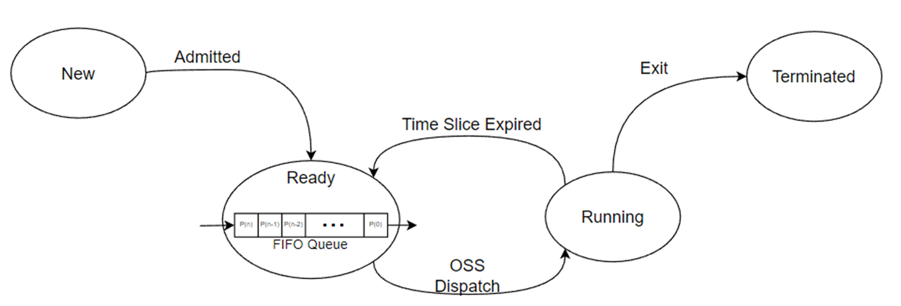
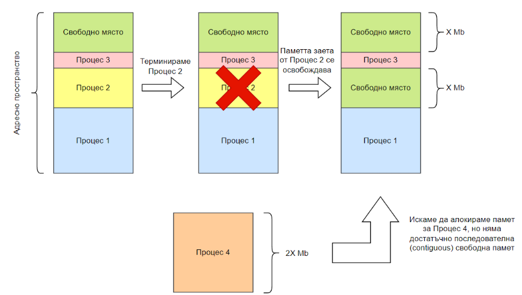
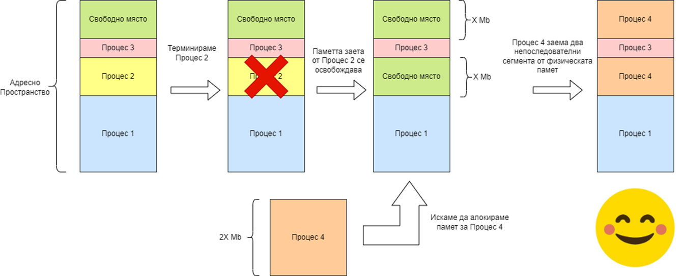
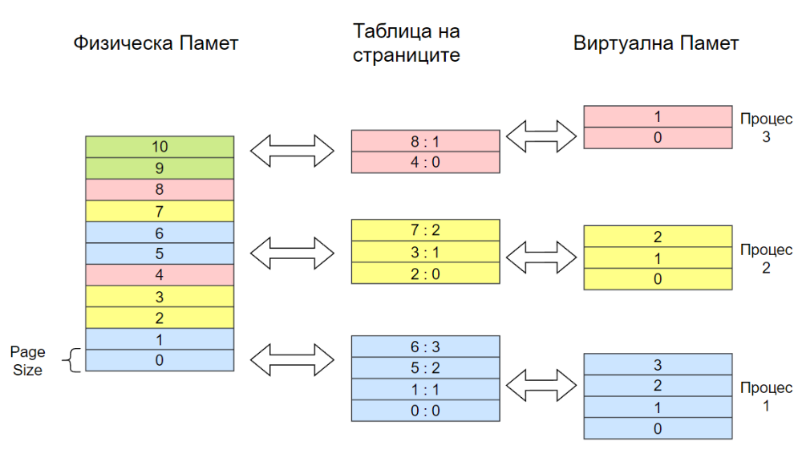
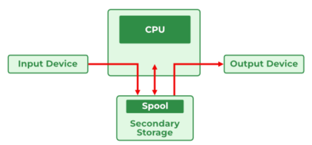

# Тема 2: Структура на операционните системи

## Съдържание
1. [Цели на операционните системи](#1-цели-на-операционните-системи)
2. [Структура на операционните системи](#2-структура-на-операционните-системи)
3. [Отговорности на ядрото](#3-отговорности-на-ядрото)
4. [Управление на процесите (Process Management)](#4-управление-на-процесите-process-management)
5. [Управление на паметта (Memory Managment)](#5-управление-на-паметта-memory-managment)
6. [Управление на входно-изходните устройства (I/O Management)](#6-управление-на-входно-изходните-устройства-io-management)
7. [Управление на външно-запаметяващите устройства (Storage Management)](#7-управление-на-външно-запаметяващите-устройства-storage-management)
8. [Имплементация на защитна сигурност (Security)](#8-имплементация-на-защитна-сигурност-security)

---

## 1. Цели на операционните системи
- Многозадачност
    - Илюзията за многозадачност (паралелно изпълнение) се постига чрез използване на таймери, които генерират прекъсвания на определено време (интервал).
    - Прекъсвания, генерирани от таймери, сменят процеса (задачата), която се изпълнява от процесора. Това се нарича времедделение.
    - В днешно време, процесорите често имат по няколко ядра, които могат да изпълняват задачи едновременно (може да ги разглеждаме като няколко процесора в една компютърна система).
    - Върху всяко ядро се реализира времеделение.
- Многопотребителност
    - Многопотребителността е способността на операционната система да поддържа различни (множество) потребители.

## 2. Многозадачност и превантивно времеделене
- **Системен** таймер и прекъсване: Времето за изпълнение на всяка програма е ограничено от т.нар. времеви дял (time slice). Когато времевият дял изтече, системният таймер генерира сигнал за прекъсване, който временно спира изпълнението на текущата програма.
- **Запазване на състоянието и ISR**: След прекъсването, състоянието на текущата програма се запазва в паметта, за да може тя да бъде възобновена по-късно. Изпълнява се ISR на системния таймер.
- **Стартиране на OS Scheduler**: ISR на системния таймер стартира OS Scheduler. Scheduler-ът е системна програма, която решава коя задача да се изпълнява следваща, на база на предварително зададени правила и приоритети.
- **Изпълнение на следващата програма**: OS Scheduler избира следващата програма, която трябва да получи процесорно време, и възобновява нейното изпълнение. Процесът продължава циклично, като всяка програма получава свой времеви дял.
- **Повтаряне на цикъла**: Цикълът се повтаря за всички програми в системата, като се осигурява равноправно използване на процесора от различните задачи.

 

## 3. Структура на операционните системи
Операционната система може да се раздели на две части:
- Ядро (Kernel)
    - Най-ниското ниво на една операционна система
    - Отговаря за управлението на различните части на една компютърна система - т.е. директно управлява хардуера
    - Единственият компонент на ОС, който може да работи в привилегирован режим.
    - Ядрото съдържа всички драйвери за устройствата (софтуер за оправляване на устройствата), които се намират в компютърната система.
    - Ядрото предоставя и функции, наречени **системни повиквания** (на англ. system calls или на кратко sys-calls), които могат да се извикват от потребителските програми или от други части на операционната система. Някои типове системни функции са следните:
        - Функции за управление на процесите – `fork()`, `waitpid()`, `execvpe()`, `exit()`, т.н.
        - Функции за работа с файлове – `open()`, `close()`, `read()`, `write()`, `lseek()`, т.н.
        - Работа с файловата система – `stat()`, `mkdir()`, `rmdir()`, `link()`, `unlink()`, `mount()`, `umount()`, `chmod()`.
        - и други.
    
- Обвивка (Shell)
    - Командния интерпретатор е набор от приложни програми, които комуникират с ядрото чрез системни извиквания.
    - Предоставя среда и интерфейс за улеснена работа с операционната, както на хора, така и на други приложни програми.
    - Това е видимият потребителски интерфейс на операционната система.
    - Обикновено се зарежда върху нея и предлага на потребителите команди, които им осигуряват достъпа до операционната система - примерно както GNU+Linux са неразделни части на една цяла система - GNU - shell, Linux - kernel.

 

## 4. Отговорности на ядрото
Понеже ядрото седи между обвивката и хардуера на компютърната система, то следи и отговаря за следните аспекти на компютърната система:
- Управление на процесите (Process Management) 
- Управление на паметта (Memory Management)
- Управление на входно-изходните устройства (I/O Management)
- Управление на външно-запаметяващите устройства (Storage Management)
- Имплементация на защитна сигурност (Security)

## 5. Управление на процесите (Process Management)
- Процесът е програма по време на нейното изпълнение. 
- Процесът изпълнява инструкциите на програмата една по една.
- След последната инструкция, процесът се терминира.
- От една програма може да има множество процеси, които може да се изпълняват едновременно или един след друг. Но във всеки един момент всеки един процес може да изпълнява точно една програма.
- Всеки процес има едно от следните състояния:
    - Нов (New)
    - Готов (Ready)
    - Изпълняващ се (Running)
    - Блокиран (Waiting)

 

- **Admitted** – Когато един процес е създаден, той първо преминава през състоянието "Нов" (New). След като операционната система го инициализира напълно, процесът става "Готов" (Ready), което означава, че е готов да се изпълни, но чака в опашката за процесорно време.

- **OSS Dispatch** – Когато операционната система реши, че е време да даде процесорно време на този процес, той преминава в състояние "Изпълняващ се" (Running), което означава, че в момента се изпълнява.

- **I/O or event wait** – Един процес може да премине от "Готов" към "Блокиран" (Blocked), ако не се нуждае от процесорно време на момента. Това се случва, когато процесът чака нещо, например завършване на I/O операция или вход от потребителя. ("blocked" и "waiting" описват едно и също състояние – процесът е блокиран и чака външно събитие, за да може да продължи.)

- **Time Slice Expired** – Ако операционната система реши да даде процесорно време на друг процес, текущият процес преминава от "Изпълняващ се" обратно към "Готов". Това изисква осъществяване на context switching (смяна на контекста) между процесите, за да може текущият процес да продължи от същото място, когато отново получи процесорно време. (Тук начина на работа е аналогичен с превантивно времеделене)

- **Exit** - Когато изпълнението на процеса приключи, той преминава в състояние "Терминиран" (Terminated), което оазначава, че процесът е завършен и освобождава всички ресурси, които е използвал.

- Операционната система предоставя механизми за синхронизация и комуникация между процесите.
    - Комуникация – да се прехвърлят данни между процесите.
    - Синхронизация между процесите.

- Всеки процес има идентификационен номер - `pid`, който е положително число.

- Когато даден процес (например P1) иска да създаде нов процес, той използва системното извикване fork(). Новият процес (P2) е точно копие на родителския процес (P1). Така P1 се нарича родител на P2. Всички процеси в операционната система имат такава йерархична структура.

- Копието на процеса може да бъде заменено с нова програма чрез системно извикване от фамилията exec (напр. execl, execvp). С exec процесът не се създава отново, а само се заменя с друга програма, запазвайки същия pid (идентификатор). (Повече информация [тук](https://www.openai.com).)

- При стартиране на операционната система се създава специален "инициализиращ" процес, наречен init, който е родител на всички останали процеси. (Tова е вярно за повечето популярни операционни системи, особено Linux. Windows използва подобен подход, макар и с различна структура и термини.)

- При стартиране на операционната система се създава специален "инициализиращ" процес, наречен init, който е родител на всички останали процеси. (Tова е вярно за повечето популярни операционни системи, особено Linux. Windows използва подобен подход, макар и с различна структура и термини.)

- Ако се терминира процес, стандартното поведение е да не се терминират децата му. Вместо това, при терминирането на родителски процес, на децата се назначава нов родител - init процеса.

## 6. Управление на паметта (Memory Managment)
- RAM паметта представлява огромен масив от байтове, който е енергозависим.
- Ако се терминира процес, стандартното поведение е да не се терминират децата му. Вместо това, при терминирането на родителски процес, на децата се назначава нов родител - init процеса.
- Ядрото има следните 3 функции, когато работи с оперативната памет:
    - да заделя и освобождава оперативната памет, когато е нужно
    - да следи кои части от паметта собственост на кои процеси са
    - да решава кои данни и процеси трябва да са в RAM паметта

## 6.5. Paging

- Paging е техника за управление на паметта, която позволява на операционната система да разделя физическата памет на фиксирани блокове, наречени „страници“ (pages). Когато даден процес иска памет, тя се разпределя на отделни страници, а не като един голям блок. Това позволява процесите да се разпределят на малки парчета из паметта, вместо да заемат едно голямо непрекъснато място. По този начин се избягва фрагментацията и се използва паметта по-ефективно.

 

 - При paging всеки процес получава „виртуална памет“, която операционната система превежда във физически адреси чрез таблица на страниците (page table). Така процесите могат да работят сякаш разполагат с непрекъсната памет, докато физически тя може да е разпръсната из RAM.

 

- Структура на виртуалния адрес
    - Номер на страница (Page Number) - Номер на страницата във виртуалното адресно пространство на процеса.
    - Отместване (offset) - адрес на конкретна дума в рамките на страницата.

- Таблица на страниците (Page Table)
    - Всеки процес иам своя собствена таблица на страниците.
    - Таблицата свързва всеки виртуален номер на страница с физичеса рамка в RAM паметта.

 

- Преобразуване (Address Translation)
    - Извличане на номера на страницата и отместването от виртуалния адрес.
    - Използване на номера на страницата за намиране на съответната физическа рамка в таблицата на страниците.
    - Комбиниране на физическата рамка и отместването за получаване на крайния физически адрес.

 

## 7. Управление на входно-изходните устройства (I/O Management)
- Oсновна функция на операционната система (ОС), отговаряща за комуникацията между софтуерните приложения и хардуерните устройства (напр. дискове, принтери, мрежови карти).

 - **Драйвери на устройства (Device drivers)** са специализирани софтуерни модули, които позволяват на ОС да комуникира с хардуерни устройства. Всеки тип устройство (напр. клавиатура, мишка, принтер, твърд диск) има съответстващ драйвер, който служи като преводач, преобразувайки командите на ОС в инструкции, специфични за устройството.

 - **Драйверите се намират в ядрото**, защото достъпът до хардуера изисква изпълнение на защитени инструкции на процесора (привилегирован режим).
 
 - **Приложенията не могат да комуникират директно с драйверите**, само операционната система може да го прави.

 - Взаимодействие с драйвера:
    - **Заявка от приложението**: Приложението иска да извърши I/O операция (напр. четена на файл).
    - **Системно повикване**: Приложението извършва системно повикване (system call) към ядрото.
    - **Извикване на драйвера**: Ядрото определя подходящия драйвер и предава заявката към него.
    - **Взаимодействие с хардуера**: Драйверът комуникира с хардуерното устройство и изпълнява командите.
    - **Трансфер на данни**: Данните се прехвърлят между устройството и паметта на системата (Синхронно/Асинхронно/Директен достъл до паметта).
    - **Завършване**: Устройството сигнализира за завършване, драйверът уведомява ядрото, а ядрото връща резултата на приложението.

- Ядрото предоставя единен интерфейс за I/O операции, който абстрахира детайлите на отделните устройства, позволявайки на ОС да работи със различен хардуер по стандартизиран начин. 

- Интерфейсът е част от I/O подсистемата на ядрото, която се грижи за задачи като:
    - Буфериране: Временно съхраняване на данни за управление на разликите в скоростта между устройствата и процесора.
    - Кеширане: Запаметяване на често достъпвани данни в бързата памет (RAM) за подобряване на производителността.
    - Spooling: Управление на данните за устройства, които не могат да обработват множество I/O операции едновременно (напр. принтери).

- Ядрото предоставя системни повиквания като read(), write(), open(), и close(), които приложенията използват за I/O операции.

- Ядрото представя всяко хардуерно устройство като специален файл в файловата система (напр. /dev/sda за твърд диск, /dev/ttyUSB0 за USB устройство).

- Tипове устройства:
    - Символни устройства (напр. клавиатури) предават данни символ по символ.
    - Блокови устройства (напр. дискове) работят с данни на блокове.
    
 - Интерфейсът е част от I/O подсистемата на ядрото, която се грижи за задачи като:
    - Буфериране се използва за компенсиране на разликите в скоростта между I/O устройствата и процесора. Данните се съхраняват временно в буфер, позволявайки на процесора да продължи работа, докато устройството обработва данните (или обратното).

    - Кеширане подобрява производителността, като запазва копие на често достъпвани данни в бързата памет, намалявайки необходимостта от чести достъпи до бавни устройства за съхранение.

    - Spooling (Simultaneous Peripheral Operations On-Line) е техника за управление на устройства с малки буфери или бавна скорост, като принтери и стари магнитни ленти.
        - ОС поставя заявките за I/O операции в опашка (spool), която се съхранява временно на твърдия диск или в паметта.
        - Spooler-ът чете малки части от данните от опашката и ги предава на устройството, като запълва буфера постоянно.

 
    

## 8. Управление на външно-запаметяващите устройства (Storage Management)
- Устройства за съхранение на данни са вид IO устройства.
- Използват, тъй като искаме данните да оцелеят при спиране на системата, както тези, които не се побират за RAM паметта.
- Хардуерните устройства се различават по скорост, обем и начин на работа. Целта на ядрото е да скрие тези различия. Затова операционната система създава се концепцията за файл, за да ни е по-лесно.
- Файл
    - Файлът е основната абстракция, използвана от операционната система за управление на данни.
    - Той представлява поредица от байтове, която се интерпретира в зависимост от файловата система.
    - Файлът може да съдържа текст, изображения, програми и други типове данни.

- Файлова система
    - Файловата система също е абстракция за организирането на байтовете. Структуриране на байтове, директории, файлове, права за достъп до тези директории, организация и т.н. Целта на директориите е организираност.
    - Тя позволява създаване, четене, писане, изтриване и преименуване на файлове и директории.
    - Файловата система също така поддържа потребителски права за достъп.
    
- **Права за достъп до файловe**
    - Права на потребителя (owner) - права за четене, писане и изпълнение.
    - Права на групата (group) - права за определена група потребители.
    - Права за други (others) - права за всички останали потребители.

- Файловите права в Unix/Linux системи се изразяват с трицифрен код, като всяка цифра представлява правата на различна категория:
    - Първа цифра: Права за собственика на файла (User)
    - Втора цифра: Права за групата (Group)
    - Трета цифра: Права за всички останали потребители (Others)
    
- Стойности на правата
    - 4 – Четене (r)
    - 2 – Писане (w)
    - 1 – Изпълнение (x)

- Числата се сумират за определяне на правата. Например:
    - 7 = Четене + Писане + Изпълнение (4 + 2 + 1)
    - 5 = Четене + Изпълнение (4 + 1)
    - 6 = Четене + Писане (4 + 2)

- **Пример**Кодът 755 означава:
    - 7 (User): Четене, Писане, Изпълнение
    - 5 (Group): Четене, Изпълнение
    - 5 (Others): Четене, Изпълнение

## 9. Имплементация на защитна сигурност (Security)
Oперационната система предоставя защита, която представлява механизъм, който контролира достъпа на потребителите и процесите. Като се разделя на 2 части:

- Хардуерна защита
    - Съществуването на привилегирован и непривилегирован режим на процесора, който има само изключително малък набор от инструкции.
    - Операционната система се намира в RAM паметта – тя е защитена на хардуерно и софтуерно ниво. На хардуерно ниво е посочено кои байтове може да се достъпват от неприлегирования и от привилегирования режим. - Има регистри, които определят тези адреси – BASE, LIMIT.
    - Таймерите на процесора също са защита – генерира се прекъсване, за да се прекрати работното време на процес върху процесора (т.е. за да не може даден процес да завземе цялото процесорно време).
    - Работата с I/O устройства не може да се изпълнява в неприлегирован режим - ядрото служи като посредник между потребителските процеси и хардуера.      

- Софтуерна защита
    - Правилата за достъп на файловата система за всеки потребител
    - Всеки процес се асоциира с определено парче памет
    - Ядрото е разделено на няколко слоя с различни привилегии

 

- Ядрото е разделено на няколко слоя с различни привилегии
    - **Пръстените на привилегии** са механизъм за защита в процесорите, използван за разграничаване на различни нива на достъп до ресурси.
    - Процесорите x86/x86-64 имат 4 пръстена на привилегии, номерирани от 0 (най-привилегирован) до 3 (най-ниско привилегирован).
    - Те осигуряват сигурност и защита, като ограничават действията на кода в зависимост от текущото ниво на привилегия.
    
| Ring   | Ниво на достъп            | Описание                                |
|--------|---------------------------|-----------------------------------------|
| Ring 0 | Най-високо (Kernel Mode)  | Операционна система и ядро              |
| Ring 1 | Средно                    | Системен софтуер и драйвери (неизползвано) |
| Ring 2 | Средно                    | Драйвери на устройства (неизползвано)   |
| Ring 3 | Най-ниско (User Mode)     | Приложения и потребителски процеси      |

